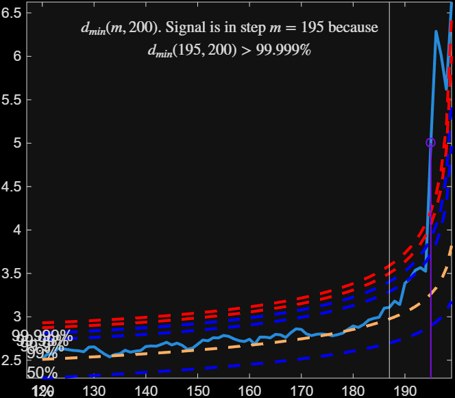
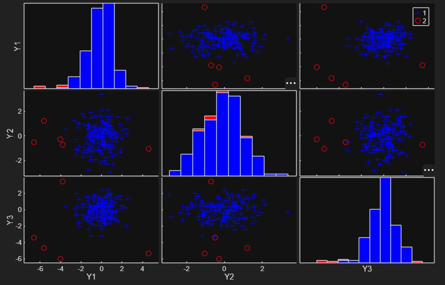

# FSM

FSM computes the forward search estimator in multivariate analysis. The
search grows a clean subset of observations step by step, monitoring the
minimum Mahalanobis distance at every step; a unit that only enters late,
with an unusually large distance, is flagged as an outlier.

## Input arguments

Mandatory:

| Argument | Type | Description |
|---|---|---|
| `Y` | `ndarray`, `n x v` | data matrix, one row per observation, one column per variable. `NaN` entries are allowed -- distances for those rows are computed from the observed components only, then rescaled to stay comparable. Rows that are entirely missing are excluded automatically. |

Optional, passed as keyword arguments (the most commonly used ones -- see the
full list on RoSA, linked below, for the rest):

| Argument | Default | Description |
|---|---|---|
| `m0` | `v+1` | size of the initial subset, or a vector of specific unit indices to start from (if given, `crit` is ignored) |
| `crit` | `'md'` | how to choose the initial subset: `'md'` picks the `m0` units with the smallest Mahalanobis distance; `'biv'` and `'uni'` instead rank by how often a unit falls outside robust bivariate ellipses / univariate boxplots |
| `init` | `floor(n*0.6)` | subset size at which monitoring of the minimum Mahalanobis distance starts |
| `msg` | `True` | set to `False` to silence the progress messages printed during the search |
| `plots` | `1` | `1` draws the mmd/envelope plot and the scatterplot matrix with outliers highlighted; `2` also shows envelope-resuperimposition plots; `0` suppresses plotting |
| `bonflev` | `''` (auto) | use a Bonferroni-based stopping rule instead of the default consecutive-exceedance rule; useful for strongly non-normal data |

## Example

FSDA's own first documented example, in spirit: a simulated dataset,
contaminated in two of its three variables, run with every option left at
default. Data is generated with numpy's own RNG here, not MATLAB's -- the two
generators don't produce matching sequences even with "the same" seed, so
the specific outlier indices won't match FSDA's own MATLAB walkthrough
exactly, even though the contamination formula (`sign(randn) * 4.5`) is the
same.

```python
import numpy as np
import pyfsda

np.random.seed(123456)
n, v = 200, 3
Y = np.random.randn(n, v)

# contaminate the first 5 observations in variables 1 and 3, random sign
Ycont = Y.copy()
Ycont[0:5, [0, 2]] += np.sign(np.random.randn(5, 2)) * 4.5

pyfsda.rng(1234, nargout=0)
out = pyfsda.FSM(Ycont)

outliers = np.asarray(out["outliers"], dtype=int).ravel()
print(f"FSM flagged {len(outliers)} outliers out of {Ycont.shape[0]} observations.")
print(f"  indices: {outliers.tolist()}")

pyfsda.stop()
```

**Console Output:**

```text
-------------------------
Signal detection loop
dmin(195,200)>99% at final step: Bonferroni signal in the final part of the search.
dmin(195,200)>99.999%
-------------------
Signal validation
Validated signal
-------------------------------
Start resuperimposing envelopes from step m=194
Superimposition stopped because d_{min}(195,196)>99% envelope
$d_{min}(195,196)>99$\% envelope
----------------------------
Final output
Number of units declared as outliers=5
Summary of the exceedances
           1          99         999        9999       99999
           0           7           5           5           5

FSM flagged 5 outliers out of 200 observations.
  indices: [1, 2, 3, 4, 5]
 
```





## Output

A `dict` keyed by the FSDA field names:

| Field | Description |
|---|---|
| `outliers` | vector of units declared as outliers (1-based, matching MATLAB's own indexing), empty if the sample is homogeneous |
| `mmd` | `(n-init) x 2`: search step, minimum Mahalanobis distance at that step |
| `Un` | `(n-init) x 11`: which unit(s) entered the subset at each step |
| `nout` | `2 x 5`: how many times `mmd` exceeded the 1/99/99.9/99.99/99.999 percentile quantiles (`NaN` if `bonflev` is used instead) |
| `loc` | `1 x v`: estimated location of the data |
| `cov` | `v x v`: robust estimate of the covariance matrix |
| `md` | `n x 1`: robust squared Mahalanobis distance of every observation from `loc`, relative to `cov` |
| `class` | `'FSM'` |

## See also

- FSM documentation: <https://rosa.unipr.it/FSDA/FSM.html>
- FSDA datasets information: <https://rosa.unipr.it/FSDA/datasets_mv.html>