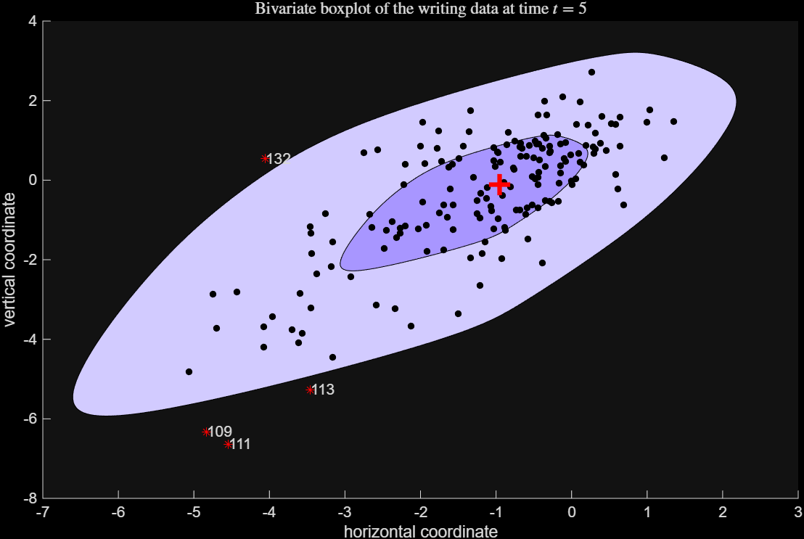

# boxplotb

`boxplotb` computes a robust bivariate boxplot, constructing inner (hinge) and outer (fence) convex hull splines to identify bivariate outliers.

## Input arguments

### Mandatory

| Argument | Type | Description |
|---|---|---|
| `Y` | `ndarray`, `n x 2` | Bivariate data matrix with $n$ observations and 2 variables. |

### Optional (Keyword Arguments)

| Argument | Default | Description |
|---|---|---|
| `coeff` | `1.68` | Expansion factor mapping the 50% hinge contour to a wider fence contour. Typical thresholds for normal data: `0.43` (75%), `0.83` (90%), `1.13` (95%), `1.68` (99%). |
| `strictlyinside` | `0` | Set to `1` to perform an additional convex hull peeling step on the 50% hull to increase robustness in small samples. |
| `plots` | `1` | Visualization option: `0` (no plot), `1` (bivariate boxplot with labeled outliers), or a `dict` with graphical parameters (`ylim`, `xlim`, `labeladd`, `InnerColor`, `OuterColor`). |
| `resolution` | `1000` | Resolution used to compute the inner and outer splines. |

---

## Example

Bivariate boxplot executed on the writing dataset:

```python
import pyfsda

# Load writing data
X = pyfsda.load("writingdata.txt")

# Compute bivariate boxplot with default settings
pyfsda.rng(1234, nargout=0)
out = pyfsda.boxplotb(X)
pyfsda.xlabel('horizontal coordinate')
pyfsda.ylabel('vertical coordinate')
pyfsda.title('Bivariate boxplot of the writing data at time $t=5$','Interpreter','Latex')

pyfsda.stop()
```




---

## Output

A `dict` keyed by FSDA structure field names:

| Field | Description |
| --- | --- |
| `outliers` | Vector containing row indices of observations located outside the outer contour (returns an empty array if no outliers exist). |
| `cent` | `2 x 1` array containing the $(x, y)$ coordinates of the robust centroid. |
| `Spl` | `r x 4` matrix containing spline coordinates. Columns 1–2 represent the inner spline $(x, y)$, and columns 3–4 represent the outer spline $(x, y)$. |
| `handles` | Handles to graphic elements (contours and centroid) for display control. |

---

## See also

* boxplotb documentation: [https://rosa.unipr.it/FSDA/boxplotb.html](https://rosa.unipr.it/FSDA/boxplotb.html)
